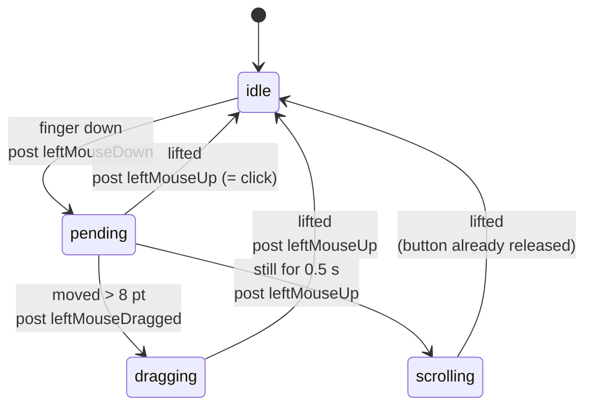

# Internals

Everything below was measured on the reference hardware — a 16" USB-C touch panel
with a `wch.cn` controller (`0x27C0`/`0x0859`) on a MacBook Pro M2 running
macOS 26. Where a number is specific to that panel it is called out, because the
first job of this document is to let you check your own.

- [The device as macOS sees it](#the-device-as-macos-sees-it)
- [Report ID 7: where the data actually arrives](#report-id-7-where-the-data-actually-arrives)
- [Why the digitizer stays silent](#why-the-digitizer-stays-silent)
- [Reading HID values in IOKit](#reading-hid-values-in-iokit)
- [The coordinate transform](#the-coordinate-transform)
- [Seizing the device](#seizing-the-device)
- [Synthesising events](#synthesising-events)
- [The gesture state machine](#the-gesture-state-machine)
- [Permissions: two TCC services](#permissions-two-tcc-services)
- [launchd: why an agent and not a daemon](#launchd-why-an-agent-and-not-a-daemon)
  - [The agent definition](#the-agent-definition)
- [Error codes you will actually hit](#error-codes-you-will-actually-hit)
- [Porting to another panel](#porting-to-another-panel)
- [Known limitations](#known-limitations)

## The device as macOS sees it

One USB device publishes three separate `IOHIDDevice` nodes, one per top-level
collection:

| Collection | Usage page | Usage | Role |
|---|---|---|---|
| Mouse | `0x01` | `0x02` | Mouse emulation — **this is the one that speaks** |
| TouchScreen | `0x0D` | `0x04` | Multitouch digitizer — silent on macOS |
| Vendor-defined | `0xFF0A` | `0xFF` | Proprietary, undocumented |

Inspect yours:

```bash
ioreg -r -c IOHIDDevice -d 1 | grep -E '\+-o |"Product"|"Transport"|"PrimaryUsagePage"|"PrimaryUsage"'
```

The report IDs declared in the descriptor:

| Report | Type | Contents |
|---|---|---|
| 7 | Input (Mouse) | Buttons + absolute X/Y + wheel |
| 10 | Feature | Contact Count Maximum (usage `0x55`), max 15 |
| 13 | Input (Digitizer) | 10 contacts: TipSwitch `0x42`, ContactID `0x51`, X, Y |
| 33 | Feature | Device Mode `0x52`, Device Index `0x53` |

Report 13 declares X with logical maximum 16383 and Y with 9599 — the same ranges
report 7 uses, which is a useful cross-check that both paths describe one physical
surface.

## Report ID 7: where the data actually arrives

Seven bytes, little-endian:

```
07  01  00 35  7C 0E  00
│   │   │      │      └── wheel (always 0 on this panel)
│   │   │      └───────── Y, 16-bit LE   0x0E7C = 3708
│   │   └──────────────── X, 16-bit LE   0x3500 = 13568
│   └──────────────────── buttons, bit 0 = finger down
└──────────────────────── report ID
```

Both axes are **absolute**, not relative. That single fact is the whole bug: an
absolute pointing device gives macOS a position but no display to anchor it to.

Watch them live:

```bash
sudo touchmap --debug --no-seize
```

The panel emits a report roughly every 8 ms while touched, repeating the previous
values unchanged when the finger is still.

## Why the digitizer stays silent

Windows touch panels boot in mouse-emulation mode. The host switches them to
multitouch by writing the **Device Configuration** feature report — report ID 33
here, carrying Device Mode (`0x52`) and Device Index (`0x53`). Windows does this
during enumeration. macOS never does, so the digitizer collection never produces a
single report.

`touchmap` can attempt the write, but on this controller it is theatre:

```
Device Mode before: 161,1,33,3,0,0,8,0
wrote mode 0: 0x00000000 → reads back: 161,1,33,3,0,0,8,0
wrote mode 1: 0x00000000 → reads back: 161,1,33,3,0,0,8,0
wrote mode 2: 0x00000000 → reads back: 161,1,33,3,0,0,8,0
wrote mode 3: 0x00000000 → reads back: 161,1,33,3,0,0,8,0
```

Every `IOHIDDeviceSetReport` returns `kIOReturnSuccess` and nothing is stored. The
readback is constant, and it is not a mode value at all: `161,1,33,3` is
`0xA1 0x01 0x21 0x03` — `Collection (Application)`, a fragment of a HID descriptor.
The controller is returning bytes out of a fixed buffer.

Check your own panel before assuming it behaves the same:

```bash
sudo touchmap --probe-modes --debug
```

If the readback tracks what you write, and `raw id=13` reports start appearing, the
panel supports multitouch and the two-or-more-contacts branch in `emit()` takes
over — two-finger scrolling then works with no further changes.

## Reading HID values in IOKit

Three details cost real debugging time:

**Callbacks fire per element, only on change.** `IOHIDDeviceRegisterInputValueCallback`
does not hand you a frame. Each changed field arrives separately, so state must be
accumulated. Fields that did not change are not re-reported — a finger held
perfectly still generates no callbacks at all, which is why the hold-to-scroll
transition is driven by a `CFRunLoopTimer` rather than by input.

Observed order within one report: wheel (`0x38`), Y, X, then button. The wheel
element fires on every report even though its value never changes, which makes it a
convenient heartbeat and a nuisance in logs.

**Group contacts by parent collection cookie**, not by ContactID:

```swift
guard let parent = IOHIDElementGetParent(el) else { return }
let key = IOHIDElementGetCookie(parent)
```

Collection cookies are stable for the life of the device. Reported ContactIDs are
not guaranteed to be.

**Filter out relative axes.** A real mouse also reports usage page `0x01`, usages
`0x30`/`0x31`. Without this guard the tool would hijack an ordinary mouse that
happened to share a vendor ID:

```swift
if IOHIDElementIsRelative(el) { return }
```

**Read logical maxima from the elements, never hardcode them:**

```swift
c.xMax = Int(IOHIDElementGetLogicalMax(el))
```

## The coordinate transform

macOS global desktop coordinates put the main display's top-left at `(0, 0)`, with
y increasing downward. A display placed to the left of the main one has a
**negative** x origin:

```
built-in (main)   1680x1050 @ (0, 0)
touch panel       1920x1080 @ (-1920, 0)
```

The transform is therefore:

```swift
let p = CGPoint(x: bounds.minX + (Double(c.x) / Double(c.xMax)) * bounds.width,
                y: bounds.minY + (Double(c.y) / Double(c.yMax)) * bounds.height)
```

Verified against all four corners of the reference panel:

| Corner | Raw | Mapped | Expected |
|---|---|---|---|
| Top-left | 0/16383, 12/9599 | −1920, 1 | −1920, 0 |
| Top-right | 16371/16383, 96/9599 | −1, 10 | −1, 0 |
| Bottom-right | 16358/16383, 9588/9599 | −2, 1078 | −1, 1079 |
| Bottom-left | 12/16383, 9576/9599 | −1918, 1077 | −1920, 1079 |

Within one pixel everywhere, using the panel's full logical range. No calibration
step is needed or offered.

`CGDisplayBounds` returns points, not pixels, and already accounts for Retina
scaling — do not apply a backing-scale factor.

Verified in all four arrangements, including a panel placed above the built-in
display, where the origin's y goes negative:

| Panel placed | Origin | Top-left maps to | Bottom-right maps to |
|---|---|---|---|
| Left | (−1920, 0) | −1920, 0 | 0, 1080 |
| Right | (1680, 0) | 1680, 0 | 3600, 1080 |
| Above | (0, −1080) | 0, −1080 | 1920, 0 |
| Below | (0, 1050) | 0, 1050 | 1920, 2130 |

**Do not cache the rectangle.** An earlier version stored it and refreshed from
`CGDisplayRegisterReconfigurationCallback`. In a plain command line process that
callback proved unreliable: dragging the panel to the other side in System
Settings produced no notification at all — not even with the filter widened to
every flag except `beginConfigurationFlag`. The cached rectangle kept pointing at
where the display used to be, so touches landed on empty desktop, and the tool
looked broken with nothing in the log to explain it.

**Look it up once per gesture instead.** `CGDisplayBounds` always reports the
current position, so calling it when a gesture begins picks up any rearrangement
on the very next touch — no notification required. A screen cannot be moved while
a finger is already down, and holding the rectangle steady for the duration also
stops a drag shifting under itself.

Not per report, though. `CGDisplayBounds` is not the cheap accessor it looks like:

```
CGDisplayBounds:  11.4 µs per call   (M2, 1,000,000 iterations)
```

It is an IPC round trip to the window server, not a memory read. At the ~125
reports per second a drag produces that is 0.14 % of a core — negligible in
absolute terms, but 125× more work than the once-per-gesture version for no gain.
The measurement is worth repeating if you change this; the intuition that it is
free is wrong.

Only the display *id* is cached across gestures. The reconfiguration callback
survives solely to invalidate that id, which matters when a display named by
`--display` reconnects and is assigned a different one.

## Seizing the device

```swift
IOHIDManagerOpen(manager, IOOptionBits(kIOHIDOptionsTypeSeizeDevice))
```

Seizing stops macOS delivering the panel's input to the normal event stream. Both
halves matter: without it macOS keeps mapping touches to the cursor's display
*while* `touchmap` posts corrected events, and the two fight — the cursor jumps and
clicks land twice in different places.

The matching dictionary deliberately specifies **only** vendor and product ID, so
every collection on the device is opened and seized together. Matching on
usage page/usage would seize the silent digitizer and leave the Mouse collection —
the one carrying the data — in macOS's hands.

Seizing requires **Input Monitoring, not root**. Running under `sudo` appears to
work only because the process then inherits the terminal's grant.

## Synthesising events

```swift
CGEvent(mouseEventSource: nil, mouseType: type,
        mouseCursorPosition: p, mouseButton: .left)?
    .post(tap: .cghidEventTap)
```

`kCGHIDEventTap` injects at the lowest level, so events reach every application
including those that ignore session-level taps.

**A click needs duration.** An early version posted `leftMouseDown` and
`leftMouseUp` back to back when the finger lifted, which is the natural design for
a touchscreen and lets you distinguish a long press without delaying every tap.
Applications ignored it completely — the cursor moved to the right place and
nothing happened, because both events carried the same timestamp. Press on
touch-down instead.

`clickState` must be set for double-clicks to register:

```swift
e.setIntegerValueField(.mouseEventClickState, value: Int64(clickState))
```

The tool counts a second press within 450 ms and 12 points as `clickState = 2`.

Scrolling uses pixel units so it tracks the finger one-to-one:

```swift
CGEvent(scrollWheelEvent2Source: nil, units: .pixel,
        wheelCount: 2, wheel1: dy, wheel2: dx, wheel3: 0)
```

`wheel1` is vertical, `wheel2` horizontal. Positive `wheel1` moves content the same
way the finger moves, matching macOS natural scrolling.

## The gesture state machine



`pending` is the ambiguous state: the button is already down, but whether this
becomes a click, a drag or a scroll is not yet known. Movement past `MOVE_SLOP`
(8 points) resolves it to a drag; the timer resolves it to a scroll; lifting
resolves it to a click.

Entering `scrolling` posts `leftMouseUp` first, so a long press emits a complete
click before scrolling begins. That is a deliberate trade: the alternative is a
button left held down for the duration of the scroll, which breaks text selection
and drag targets far more visibly than a stray focus click.

## Permissions: two TCC services

Two independent grants, both keyed to the binary:

| Service | Setting | Needed for | API to check |
|---|---|---|---|
| `kTCCServiceListenEvent` | Input Monitoring | Opening and seizing the device | `IOHIDCheckAccess(kIOHIDRequestTypeListenEvent)` |
| `kTCCServicePostEvent` | Accessibility | Posting mouse events | `AXIsProcessTrusted()` |

`touchmap --status` calls both directly rather than inferring from symptoms.

**Grants follow the responsible process.** Launched from Terminal, the tool
inherits Terminal's grants — which is why everything works interactively and then
fails the moment launchd starts it. Under launchd the binary stands alone and needs
grants of its own. This asymmetry hides the missing Accessibility grant through an
entire interactive debugging session.

**Grants are bound to the cdhash of an unsigned binary.** Rebuild and both silently
lapse, while the row in System Settings still displays the old entry as enabled. It
must be removed and re-added — toggling it off and on does not help. `install.sh`
therefore rebuilds only when the source is newer than the binary, and copies only
when the hashes differ.

Signing with a stable Developer ID would bind the grants to the certificate instead
and survive rebuilds. Not done here; it requires a paid Apple developer account.

## launchd: why an agent and not a daemon

The first working version installed a `LaunchDaemon` in `/Library/LaunchDaemons`.
It failed in an instructive way.

A root daemon runs in the **system** domain, outside any login session. From there:

| Call | Works? |
|---|---|
| `CGGetOnlineDisplayList`, `CGDisplayBounds` | yes — correct values returned |
| `CGEvent.post` | **no** — events never reach the desktop |

The symptom is deceptive. Seize succeeds, macOS's wrong mapping disappears, the log
shows gestures being recognised — and touching the panel does nothing whatsoever.
It looks like a worse regression than the original bug.

Since seizing needs Input Monitoring rather than root, a `LaunchAgent` in
`~/Library/LaunchAgents` under `gui/$UID` is strictly better: it can post events, it
needs no admin rights at runtime, and it survives the user's admin privileges being
revoked afterwards — which matters on managed hardware where admin is granted only
temporarily.

### The agent definition

`install.sh` copies the repository's plist to
`~/Library/LaunchAgents/io.github.markstrom.touchmap.plist`. The copy in the home
folder is the live one; the repository holds the template.

| Key | Effect |
|---|---|
| `Label` | The service's identity. This is the string in `launchctl kickstart -k gui/$UID/io.github.markstrom.touchmap` |
| `ProgramArguments` | Argv. Bare by default, so both the panel and the display are auto-detected. Extra flags go here, one `<string>` per token |
| `RunAtLoad` | Start at login. This is the autostart |
| `KeepAlive` | Restart if the process exits. This is also what produces a restart loop when something else holds the device: the process dies on `kIOReturnExclusiveAccess`, launchd revives it, repeat |
| `ProcessType` | `Interactive` keeps the scheduler from throttling it. Without it, touch response becomes uneven under load |
| `StandardOutPath` / `StandardErrorPath` | `/tmp/touchmap.log`, which `--status` parses |

Because `KeepAlive` masks a failing binary as a busy one, a crash loop looks like
"running" in `pgrep` output. `launchctl print gui/$UID/io.github.markstrom.touchmap`
shows the truth — watch the `runs` counter climb.

## Error codes you will actually hit

| Code | Constant | Meaning |
|---|---|---|
| `0xE00002E2` | `kIOReturnNotPermitted` | TCC denial — Input Monitoring missing for this binary |
| `0xE00002C5` | `kIOReturnExclusiveAccess` | Another process holds the device; usually a leftover instance |

Both surface from `IOHIDManagerOpen`. Note that a Swift `String(rc, radix: 16)` on
the negative `IOReturn` prints `-1ffffd3b`, not the constant you are looking for —
format via `UInt32(bitPattern:)` instead.

## Porting to another panel

Nothing is hardcoded; `--vendor`/`--product` exist only to override auto-detection.

1. **Confirm the class.** The panel must publish usage page `0x0D`, usage `0x04`
   over USB:

   ```bash
   touchmap --list-devices
   ```

2. **Find the live report.** Run `sudo touchmap --debug --no-seize` and touch the
   panel. Note which report ID appears and which usages carry the coordinates.

3. **Check the axis ranges.** `--verbose` prints `raw=13568/16383,3708/9599`. Touch
   each corner and confirm the extremes reach the declared maxima. If your panel
   uses only part of its range, the transform needs a calibration offset — the code
   currently assumes full range, which held on every panel tested.

4. **Try the mode switch.** `sudo touchmap --probe-modes` shows whether multitouch
   can be woken.

The transport filter matters. A MacBook's built-in trackpad is also a digitizer
with usage `0x04`, reached over SPI. `findTouchDevices()` requires
`Transport == "USB"`; without that check the tool could seize the trackpad and
leave the machine with no pointing device.

## Known limitations

- **Single contact only** on panels that ignore the mode switch, so no
  pinch-to-zoom, rotate, or two-finger scroll. Hold-and-drag substitutes for
  scrolling.
- **No hover.** The panel reports nothing until contact, so the cursor jumps rather
  than tracking an approaching finger. Tooltips and hover states only appear after
  a touch.
- **No right-click.** Nothing is mapped to a secondary button; a long press is
  taken by the scroll gesture.
- **Display rotation is not handled.** The transform assumes `degree: 0`. A rotated
  target display maps incorrectly.
- **Mirrored displays are untested.** In mirrored mode the panel's own bounds may
  not be what you want to map against.
- **A long press emits a click** before scrolling. Harmless in practice, but visible
  in applications that act on a single click.
